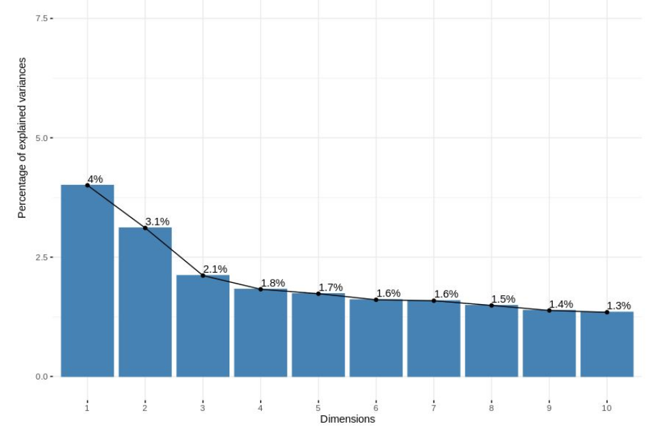

# R-projetos
Projeto elaborado na disciplina de tópicos avançado de bando de dados e inteligência artificial no curso de Engenharia de software.

Alunos: Gustavo Ventura e Ricardo Vieira

<!-- PROJECT LOGO -->
 

  

  <h3 align="center">Machine learning e exploração de dados</h3>

<!-- ABOUT THE PROJECT -->
## Sobre os projetos

Projetos desenvolvidos na tecnologia R com intuito de aprendizagem em seguintes pontos:
* Importação de datasets
* Entendimento de conjunto de dados
* Limpeza e tratamento de dados
* Balanceamanto e escalabilidade entre features
* Explorações estatísticas dos dados 
* Utilização de diferentes formas gráficas de visualização para entendimento dos dados
* Análise temporal de dados
* Aplicação de algoritmos de machine learning
* Redução de dimensionalidade 
* Extração de insights
* Contar histórias através dos dados visando entendimento de diferentes públicos sendo técnicos e não técnicos. 

### Tecnologia e datasets utilizados

Tecnologias
* [R](https://www.r-project.org/)
* [R Studio IDE](https://rstudio.com/)

Datasets
* [Breast Cancer Wisconsin](https://archive.ics.uci.edu/ml/datasets/Breast+Cancer+Wisconsin+(Diagnostic))
* [Cardiovascular Disease](https://www.kaggle.com/yassinehamdaoui1/cardiovascular-disease)
* [Crimes in Boston](https://www.kaggle.com/AnalyzeBoston/crimes-in-boston)
* Digitos

<!-- CONTACT -->
## Integrantes

Gustavo Ventura
[Linkdin](https://www.linkedin.com/in/gustavo-ventura100)
[Github](https://github.com/venturagu)

Ricardo Vieira - [Github](https://github.com/ricardolbv)

## Algumas visualizações realizadas

  
  
  
  
  
  
 

